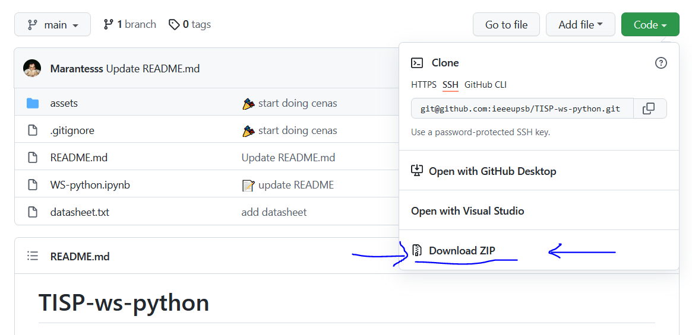

# TISP Workshop Python 🐍 🇵🇹

Este é o repositório usado para o workshop de Python usado pelo TISP.

Podes aceder à apresentação [aqui](http://tiny.cc/ieee-tisp-python)!

## Como configurar o projeto ⚒️

Não te preocupes se tiveres dúvidas a configurar o projeto. No início do workshop vamos ajudar-te na configuração! 🚧

No entanto, se te quiseres aventurar estás à vontade para tentar configurar o projeto sozinho! Boa sorte 👋

### 1. Fazer download do projeto ⬇️

Para fazeres download deste projeto carrega no botão `Code` e depois em `Download ZIP`. Segue o exemplo da imagem em baixo!



Depois de teres feito download do projeto, faz *unzip* ao ficheiro e estás pronto! 👌

### 2. Instalar `python` e `pip` 🦾

Instala [python3](https://www.python.org/) e [pip](https://pip.pypa.io/en/stable/getting-started/) no teu computador.

Abre uma linha de comandos e corre os seguintes comandos para certificar que o `python` está a funcionar:

```bash
python --version
```

Certifica-te que tens `pip` instalado com o seguinte comando:

```bash
python -m ensurepip --upgrade
```

O resultado deve ser alto deste tipo:

```
C:\Users\(username)>python --version
Python 3.9.10

C:\Users\(username)>python -m ensurepip --upgrade
Defaulting to user installation because normal site-packages is not writeable
Looking in links: c:\Users\gonca\AppData\Local\Temp\tmp2fi6k83e
Requirement already satisfied: setuptools in c:\program files\windowsapps\pythonsoftwarefoundation.python.3.9_3.9.2800.0_x64__qbz5n2kfra8p0\lib\site-packages (58.1.0)
Requirement already satisfied: pip in c:\program files\windowsapps\pythonsoftwarefoundation.python.3.9_3.9.2800.0_x64__qbz5n2kfra8p0\lib\site-packages (21.2.4)   
```

### 3. Correr o projeto 🦿

Agora que tens `python` e `pip` instalados podes abrir o terminal dentro do projeto e correr os seguintes comandos!

```bash
pip install notebook
```

Agora para correr o projeto apenas precisas de correr este comando:

```bash
# make sure you are in the project root folder
jupyter notebook
```

---

# TISP Workshop Python 🐍 🇬🇧

This is a repo with the exercises for TISP workshops!

You can access the presentation [here](http://tiny.cc/ieee-tisp-python)!

## How to run this project

Install [python3](https://www.python.org/) and [pip](https://pip.pypa.io/en/stable/getting-started/)!

```bash
# Ubuntu
sudo apt install python3 python3-dev
# make sure pip is install with the ensurepip module
python -m ensurepip --upgrade
```

Install [jupyter notebook](https://jupyter.org/) with pip.

```bash
pip install notebook
```

Now you can run this project with:

```bash
# make sure you are in the project root folder
jupyter notebook
```
